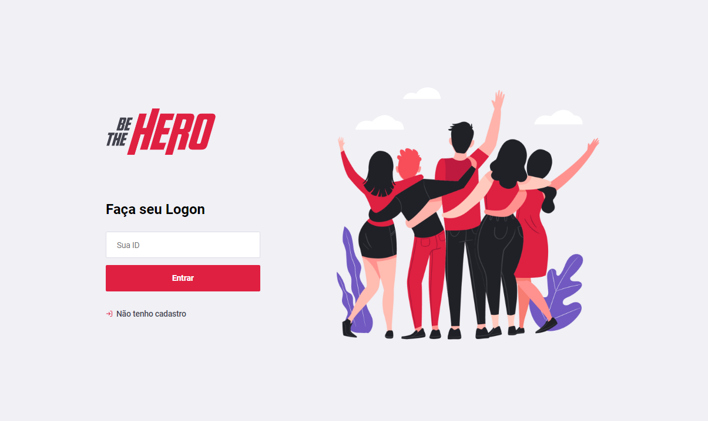
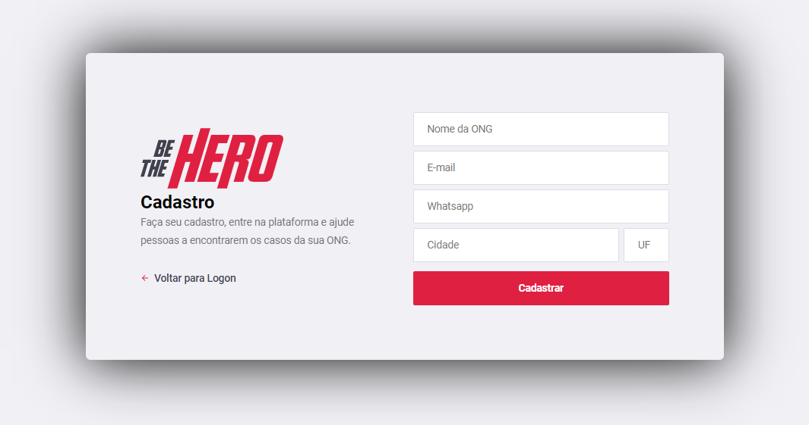
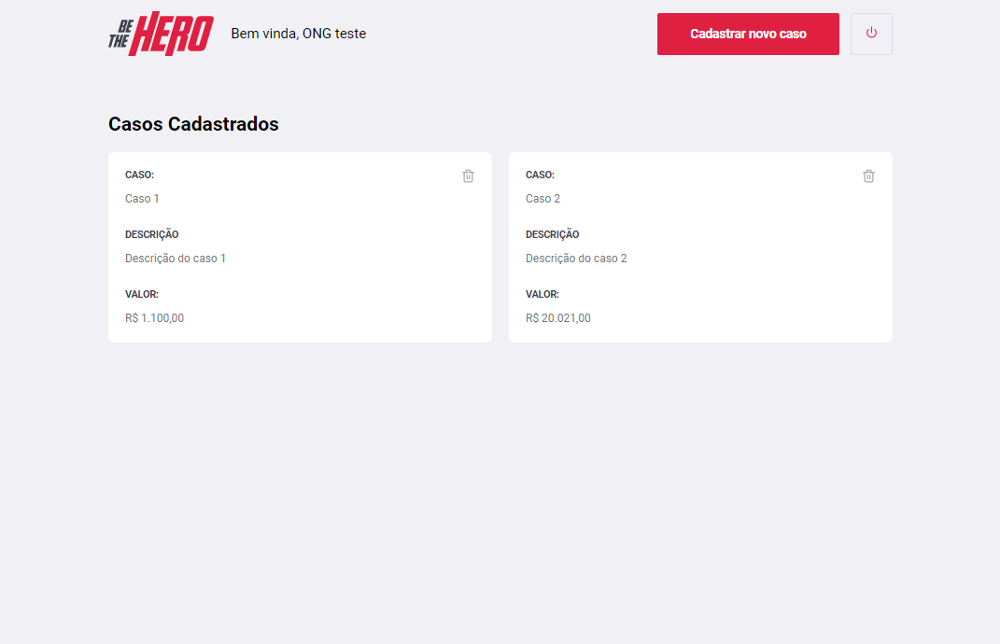
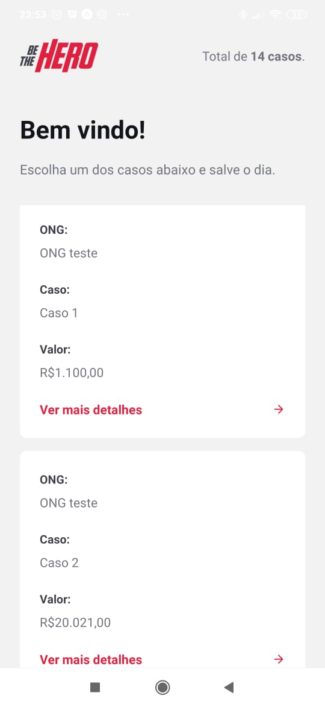
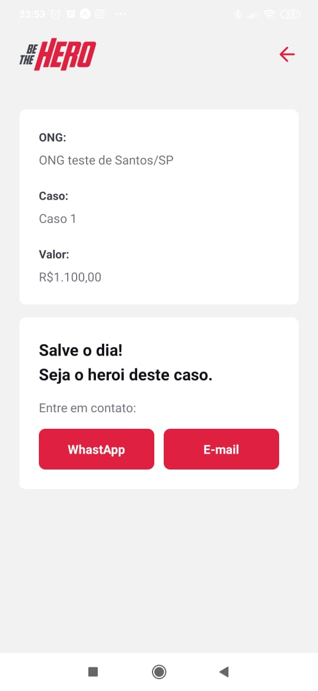
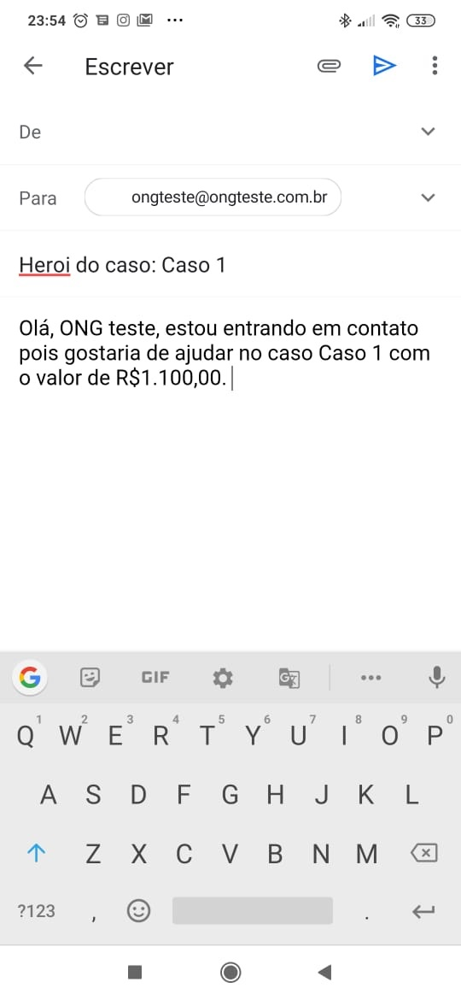

# Be the Hero

### Table of Contents

- [Description](#description)
- [Backend](#backend)
- [Frontend](#frontend)
- [Mobile](#mobile)

---
## Description

Simple RESTful API project created during "Semana OmniStack 11" for grasping the knowledge of NodeJs, React and React Native basic concepts. 

The project goal is to bring together non governamental organizations to help each other in cases and incidents that they are taking care of.

The project is divided in three topics: Backend (Node.JS), Frontend (React) and Mobile (React Native)

I'd like to thank the [Rocketseat Team](https://github.com/Rocketseat) for the excellent content provided.

Technologies and main packages used:

- Node.js, cross-env, Express (backend)
- SQLite, Knex (database)
- React, Axios (frontend)
- React Native, Expo (mobile)
- Celebrate/Jest (validations)
- Supertest (tests)

## Backend

Based on RESTful concepts, the backend database was made using Knex Query Builder and (SQLite) and the main structure was implemented with Express.js microframework.

The basic concepts of Test-Driven Development (TDD) were introduced.  

Package dependencies:

- "celebrate": "^12.0.1", for validations;
- "cors": "^2.8.5", for resource sharing;
- "cross-env": "^7.0.2", for set and use environment variables across platforms;
- "express": "^4.17.1", for organize the application into an MVC architecture;
- "knex": "^0.20.13", to help write SQL queries;
- "sqlite3": "^4.1.1", as the database.

Develop dependencies:

- "jest": "^25.2.3", for unit tests;
- "nodemon": "^2.0.2", for automatically update the server during changes;
- "supertest": "^4.0.2", for implementation tests.

## Frontend

In the frontend development, a React based website was created for NGOs to register cases and share their needs with other NGOs.

Package dependencies:

- "axios": "^0.19.2", to make HTTP requests with the backend;
- "react-icons": "^3.9.0", for visual icons;
- "react-router-dom": "^5.1.2", for routes management.

## Mobile

A React Native mobile solution was created to list all cases and their related NGOs for any other NGO that what to sponsor the cases.

The development was made in Expo platform.

Package dependencies:

- "@react-navigation/native": "^5.1.3", and "@react-navigation/stack": "^5.2.6" for navigation;
- "axios": "^0.19.2", to make HTTP requests with the backend;
- "expo-mail-composer": "~8.0.0", for integration with e-mail applications.

    
     
     
    

